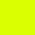

# ☄️ Meteora

## 📌 Sobre o Projeto

O **Meteora** é um e-commerce fictício de moda que apresenta uma interface moderna e intuitiva. Uma loja virtual responsiva especializada em moda contemporânea, desenvolvida com foco na experiência do usuário e design responsivo que se adapta perfeitamente a diferentes dispositivos. Foi desenvolvida com foco em *HTML*, *CSS* e *Bootstrap*, utilizando a abordagem ***mobile-first*** para garantir uma experiência fluida em todos os dispositivos.

## 🛠️ Tecnologias Utilizadas

✔️ **HTML5** – Estruturação semântica do conteúdo  
✔️ **CSS3** – Estilização personalizada e responsiva  
✔️ **Bootstrap 5.3.3** – Framework CSS para componentes

- *Bootstrap Icons*
- *Bootstrap Grid*
- *Bootstrap Flexbox*
- *Bootstrap Variables*

## ✨ Funcionalidades

- **Navegação Responsiva**: Menu hamburger para dispositivos móveis

- **Carousel de Banners**: Slider automático com indicadores visuais

- **Catálogo por Categorias**: Organização visual dos produtos por tipo

- **Seção de Produtos em Destaque**: Vitrine dos produtos mais populares

- **Sistema de Busca**: Campo de pesquisa integrado na navegação
- **Newsletter**: Formulário de cadastro para promoções e novidades

- **Facilidades da Loja**: Seção destacando benefícios como PIX, trocas e sustentabilidade

## 🚀 Experiência com o Projeto

Desenvolvido como meu oitavo projeto junto à [Alura](https://www.alura.com.br/), **Meteora** representou uma jornada leve e ao mesmo tempo enriquecedora, marcada por aprendizado constante e evolução prática. Ao longo do processo, pude consolidar conhecimentos e aprimorar habilidades, com destaques importantes como:

- Aprimoramento em layouts responsivos utilizando *Bootstrap*

- Prática com o sistema de grid, Flexbox e CSS Grid para estruturar layouts flexíveis

- Implementação de variáveis CSS utilizando *Bootstrap* para manter consistência visual

- Compreensão e uso efetivo de breakpoints e classes utilitárias do *Bootstrap* (como col, d-none, d-flex e container)

- Estratégias de otimização e carregamento condicional de imagens para diferentes dispositivos

O projeto **Meteora** foi uma oportunidade prática para explorar os principais recursos do *Bootstrap*, como o sistema de grid, componentes, variáveis, cores, breakpoints e utilitários de responsividade.

Acompanhando as aulas, entendi como estruturar páginas responsivas usando classes como col, d-none, flex, container e os próprios breakpoints (md, lg, xl, etc), além de combinar estilos do framework com CSS customizado.

Trabalhar com imagens para diferentes tamanhos de tela me ajudou a compreender a lógica por trás do carregamento condicional e otimização. Mesmo sem desenvolver do zero, o projeto me permitiu entender na prática como o Bootstrap organiza e acelera a criação de interfaces responsivas e consistentes.

## 📂 Estrutura do Projeto

```txt
meteora/
│
├── assets/
│   ├── favicon.png        # Ícone do site
│   ├── logo-meteora.png   # Logotipo da marca
│   │
│   ├── Mobile/            # Imagens otimizadas para celular
│   │   ├── banner1-mobile.png
│   │   ├── banner2-mobile.png
│   │   ├── banner3-mobile.png
│   │   ├── categorias/...
│   │   └── produtos/...
│   │
│   ├── Tablet/            # Imagens otimizadas para tablet
│   │   ├── banner1-tablet.png
│   │   ├── banner2-tablet.png
│   │   ├── banner3-tablet.png
│   │   ├── categorias/...
│   │   └── produtos/...
│   │
│   └── Desktop/           # Imagens otimizadas para desktop
│       ├── banner1-desktop.png
│       ├── banner2-desktop.png
│       ├── banner3-desktop.png
│       ├── categorias/...
│       └── produtos/...
│
├── Palheta de Cores/...  # Cores utilizadas no README
│
├── estilos.css # Estilos customizados
│
├── index.html  # Página principal
│
└── README.md  # Documentação do projeto
```

## 🎨 Paleta de Cores

| Cor    | Hex       |                  Amostra                  |
| ------ | --------- | :---------------------------------------: |
| Branco | `#FFFFFF` |     |
| Lilás  | `#9353FF` |       |
| Preto  | `#000000` |       |
| Roxo   | `#673BB3` |         |
| Verde  | `#DAFF01` |  |

## 📜 Licença

Este projeto está sob a licença [MIT](https://opensource.org/licenses/MIT) — originalmente criado para estudos, sinta-se livre para utilizar e modificar!
